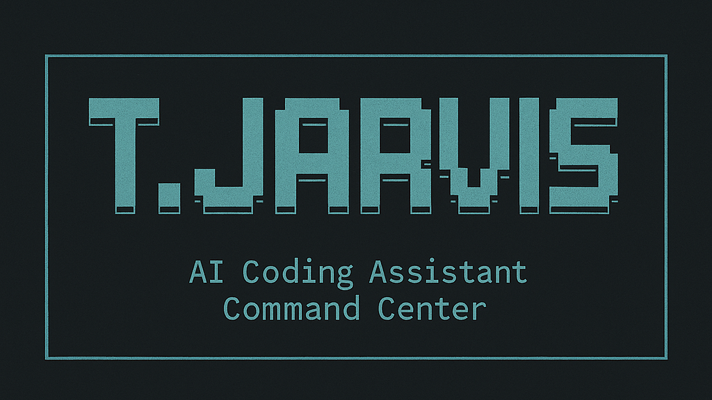

# Terminal Jarvis

[](https://www.npmjs.com/package/terminal-jarvis)
[](https://www.npmjs.com/package/terminal-jarvis)
[](https://opensource.org/licenses/MIT)
[](https://www.npmjs.com/package/terminal-jarvis)
[](https://www.npmjs.com/package/terminal-jarvis)

A unified command center for AI coding tools. Manage and run claude-code, gemini-cli, qwen-code, opencode, and llxprt from one beautiful terminal interface.



----

🎉 **Try it instantly:** `npx terminal-jarvis`

⚠️ **Known Issues**: [View current limitations and workarounds](docs/LIMITATIONS.md)

## Quick Start

```bash
# Try instantly (no installation required)
npx terminal-jarvis

# Install globally for regular use
npm install -g terminal-jarvis

# Install stable version (recommended for production)
npm install -g terminal-jarvis@stable
```

**📋 Prerequisites:**

- Node.js and NPM
- **macOS users**: [Rust toolchain required](docs/INSTALLATION.md#macos-prerequisites)

**📖 Full installation guide:** [docs/INSTALLATION.md](docs/INSTALLATION.md)

## What Terminal Jarvis Does

Terminal Jarvis is your AI coding assistant command center:

- **🤖 Interactive T.JARVIS Interface**: Beautiful ASCII art terminal UI with responsive design
- **⚡ One-Click Tool Management**: Install, update, and run AI coding tools seamlessly
- **� Supported Tools**:
  - `claude` - Anthropic's Claude for code assistance
  - `gemini` - Google's Gemini CLI tool
  - `qwen` - Qwen coding assistant
  - `opencode` - Terminal-based AI coding agent 🧪
  - `llxprt` - Multi-provider AI coding assistant 🧪
- **📊 Smart Status Detection**: See which tools are installed and ready to use
- **� Interactive Workflows**: Guided prompts for running tools with the right arguments

🧪 = _Looking for testers! These tools are new additions._

## How to Use Terminal Jarvis

### Interactive Mode (Recommended)

```bash
# Launch the full T.JARVIS experience
terminal-jarvis
```

Get the complete interface with:

- 🎨 Beautiful ASCII art welcome screen
- 📊 Real-time tool status dashboard
- ⚡ Quick tool selection and launching
- 🔧 Built-in management options
- 💡 Smart guidance and tips

### Direct Commands

```bash
# Install and manage tools
terminal-jarvis install claude
terminal-jarvis update               # Update all tools
terminal-jarvis list                # Show tool status
terminal-jarvis info claude         # Tool details

# Run tools directly
terminal-jarvis run claude --prompt "Refactor this function"
terminal-jarvis run gemini --file src/main.rs
terminal-jarvis run qwen --analyze
terminal-jarvis run opencode --generate
terminal-jarvis run llxprt --help
```

### Template Management

```bash
# Template workflow (requires gh CLI)
terminal-jarvis templates init       # Setup templates repo
terminal-jarvis templates create my-template
terminal-jarvis templates list
terminal-jarvis templates apply my-template
```

## Supported AI Tools

| Tool       | Description                            | Status           | Package                     |
| ---------- | -------------------------------------- | ---------------- | --------------------------- |
| `claude`   | Anthropic's Claude for code assistance | ✅ Stable        | `@anthropic-ai/claude-code` |
| `gemini`   | Google's Gemini CLI tool               | ✅ Stable        | `@google/gemini-cli`        |
| `qwen`     | Qwen coding assistant                  | ✅ Stable        | `@qwen-code/qwen-code`      |
| `opencode` | Terminal-based AI coding agent         | 🧪 Testing       | Install script              |
| `llxprt`   | Multi-provider AI coding assistant     | 🧪 Testing       | NPM package                 |

\*See [limitations](docs/LIMITATIONS.md) for known issues and workarounds

## Configuration (Optional)

Terminal Jarvis works out-of-the-box, but you can customize behavior with configuration files:

**Locations** (in priority order):

- `./terminal-jarvis.toml` (project-specific)
- `~/.config/terminal-jarvis/config.toml` (user-wide)

**Example configuration:**

```toml
[tools]
claude = { enabled = true, auto_update = true }
gemini = { enabled = true, auto_update = false }
qwen = { enabled = true, auto_update = true }
opencode = { enabled = false, auto_update = false }
llxprt = { enabled = true, auto_update = true }

[templates]
repository = "your-username/jarvis-templates"
auto_sync = true
```

## Documentation

- **📋 [Installation Guide](docs/INSTALLATION.md)** - Platform-specific setup instructions
- **⚠️ [Known Limitations](docs/LIMITATIONS.md)** - Current issues and workarounds
- **🏗️ [Architecture Guide](docs/ARCHITECTURE.md)** - Technical details and development info
- **🧪 [Testing Guide](docs/TESTING.md)** - How to test and contribute

## Contributing

We welcome contributions! Here's how to get started:

1. Fork the repository
2. Create a feature branch (`git checkout -b feature/amazing-feature`)
3. Make your changes following the [architecture guide](docs/ARCHITECTURE.md)
4. Ensure tests pass (`cargo test`)
5. Commit your changes (`git commit -m 'Add amazing feature'`)
6. Push to the branch (`git push origin feature/amazing-feature`)
7. Open a Pull Request

**📖 See [Architecture Guide](docs/ARCHITECTURE.md)** for technical details and development setup.

## License

This project is licensed under the MIT License - see the [LICENSE](LICENSE) file for details.

## Roadmap

- [x] Interactive T.JARVIS Interface with ASCII art
- [x] Smart tool detection and status reporting
- [x] One-click installation with NPM validation
- [x] Responsive terminal design
- [x] Enhanced authentication flows (addressing current login issues)
- [ ] Improved wrapper layer stability
- [ ] Plugin system for custom tools
- [ ] Shell completion scripts
- [ ] Web dashboard for tool management
