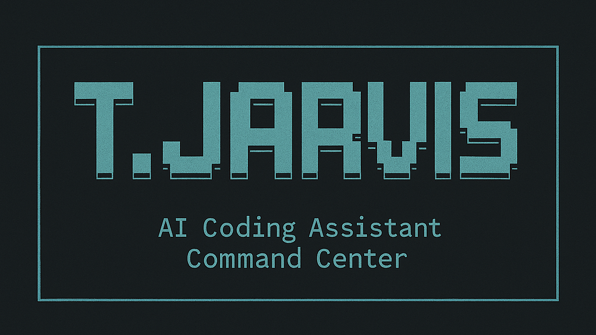

<div align="center" style="clear: both;">

# Terminal Jarvis

</div>

<!-- Inline styles to control badge alignment responsiveness in Markdown renderers that support <style>. 
		 Default inline style keeps right alignment; media queries center badges on small screens. -->

<div>

<div align="center" class="tj-badges" style="display: inline-block; min-width: 230px; max-width: 300px; text-align: right;">
<div style="text-align: inherit;"><strong>NPM</strong></div>
<a href="https://www.npmjs.com/package/terminal-jarvis"></a><br>
<a href="https://www.npmjs.com/package/terminal-jarvis"></a><br>
<a href="https://www.npmjs.com/package/terminal-jarvis"></a><br>
<a href="https://www.npmjs.com/package/terminal-jarvis"></a><br>
<div style="text-align: inherit;"><strong>Crates.io</strong></div>
<a href="https://crates.io/crates/terminal-jarvis"></a><br>
<a href="https://crates.io/crates/terminal-jarvis"></a><br>
<div style="text-align: inherit;"><strong>Homebrew</strong></div>
<a href="https://github.com/BA-CalderonMorales/homebrew-terminal-jarvis"></a><br>
<div style="text-align: inherit;"><strong>Project</strong></div>
<a href="https://opensource.org/licenses/MIT"></a><br>
<a href="https://github.com/Piebald-AI/awesome-gemini-cli"></a><br>
<a href="https://www.buymeacoffee.com/brandoncalderonmorales"></a><br>
</div>
</div>
<br clear="both">

<hr/>

<div align="center">

A unified command center for AI coding tools. Manage and run claude-code, gemini-cli, qwen-code, opencode, llxprt, codex, crush, goose, amp, and aider from one beautiful terminal interface.

</div>

<div align="center" style="border-radius: 8px;">


</div>

## Prerequisites

### **Recommended: Remote Development Environment (Zero Setup)**

The optimal way to use Terminal Jarvis is through a pre-configured remote development environment:

- **[Open in GitHub Codespaces](https://github.com/codespaces/new?template_repository=BA-CalderonMorales/terminal-jarvis)** - Instant, cloud-based development environment
- **[Use VS Code Dev Containers](https://code.visualstudio.com/docs/remote/containers)** - Local containerized environment

**Why this approach is ideal:**
- **Zero Setup Time**: Complete development environment ready in ~60 seconds
- **Consistent Environment**: Same setup across all contributors and platforms
- **Pre-installed Tools**: Rust 1.87, Node.js 20, GitHub CLI, Git LFS, LLDB debugger
- **VS Code Extensions**: GitHub Copilot, Rust debugging, TOML support pre-configured
- **Optimized Settings**: File watching excludes, format-on-save, search optimization
- **AI-Assisted Development**: GitHub Copilot pre-configured
- **All Dependencies Ready**: No manual installation of compilers or tools

### **Alternative: Local Installation**

If you prefer local development:

- **Node.js 20+** and NPM
- **macOS users**: [Rust toolchain required](docs/INSTALLATION.md#macos-prerequisites)
- **Linux users**: Build tools and development headers
- **Windows users**: Windows Subsystem for Linux (WSL2) recommended

> [!IMPORTANT]
> **Full installation guide:** [docs/INSTALLATION.md](docs/INSTALLATION.md)

## Quick Start

```bash
# Try instantly (no installation required)
npx terminal-jarvis

# Install globally for regular use
npm install -g terminal-jarvis

# Install stable version (recommended for production)
npm install -g terminal-jarvis@stable

# Install via Cargo (Rust users)
cargo install terminal-jarvis

# Install via Homebrew (macOS/Linux)
brew tap ba-calderonmorales/terminal-jarvis
brew install terminal-jarvis
```

## What Terminal Jarvis Does

Terminal Jarvis is your AI coding assistant command center:

- **Interactive T.JARVIS Interface**: Beautiful ASCII art terminal UI with responsive design
- **One-Click Tool Management**: Install, update, and run AI coding tools seamlessly

## Documentation

- **[Installation Guide](docs/INSTALLATION.md)** - Platform-specific setup instructions
- **[Usage Guide](docs/USAGE.md)** - How to use Terminal Jarvis effectively
- **[Configuration Guide](docs/CONFIGURATION.md)** - Customize Terminal Jarvis behavior
- **[Known Limitations](docs/LIMITATIONS.md)** - Current issues and workarounds
- **[Architecture Guide](docs/ARCHITECTURE.md)** - Technical details and development info
- **[Testing Guide](docs/TESTING.md)** - How to test and contribute
- **[Contribution Guide](docs/CONTRIBUTIONS.md)** - Complete contributor guidelines
- **[Roadmap](docs/ROADMAP.md)** - Future plans and development priorities
- **[Supported AI Tools](docs/SOURCES.md)** - Complete overview of all integrated AI coding tools

Terminal Jarvis provides a unified interface for multiple AI coding tools including Claude, Gemini, Qwen, and an expanding ecosystem of others. Each tool is carefully integrated with intelligent authentication flows and session management. For detailed tool information, capabilities, and current status, see our [comprehensive tool guide](docs/SOURCES.md).

> [!CAUTION]
> **Known Issues**: [View current limitations and workarounds](docs/LIMITATIONS.md)

## License

This project is licensed under the MIT License - see the [LICENSE](LICENSE) file for details.

## Support the Project

If Terminal Jarvis has been helpful for your AI coding workflow or you just thought the project is worth the maintainers going down this rabbit hole, consider supporting development:

[](https://www.buymeacoffee.com/brandoncalderonmorales)

Your support helps maintain and improve Terminal Jarvis for the entire community!
