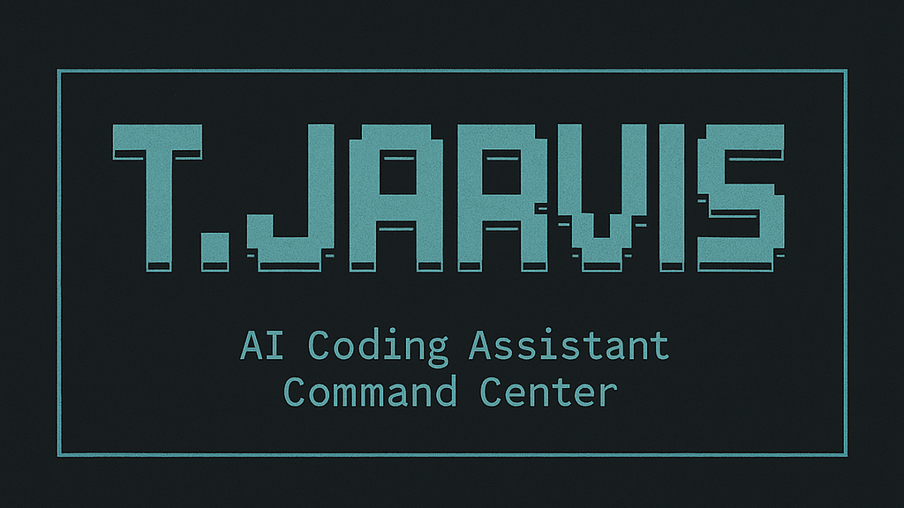

<div align="center">

# Terminal Jarvis

**Command center for orchestrating context switching between coding-agent harnesses**

Inspect and safely gate catalog descriptors for Claude, Gemini, Qwen, and 22
other AI assistants from one terminal interface.

> **Safe Testing Recommended**: Terminal Jarvis is a harness for AI coding tools
> that can modify files and execute commands. For the safest experience, test in
> a remote development environment such as
> [GitHub Codespaces](https://github.com/codespaces),
> [Coder](https://coder.com/), [DevPod](https://devpod.sh/), or
> [Google Colab](https://colab.research.google.com/).

[](https://www.npmjs.com/package/terminal-jarvis)
[](https://crates.io/crates/terminal-jarvis)
[](https://github.com/BA-CalderonMorales/homebrew-terminal-jarvis)
[](https://opensource.org/licenses/MIT)
[](https://github.com/Piebald-AI/awesome-gemini-cli)
[](https://ba-calderonmorales.github.io/my-life-as-a-dev/latest/projects/active/terminal-jarvis/)
[](https://github.com/BA-CalderonMorales/terminal-jarvis/actions/workflows/ci.yml?query=branch%3Adevelop)




</div>

---

> **Catalog truth**: A data-driven harness catalog for AI coding agents. It maps
> **25 coding-agent CLIs** through a shared **9-capability contract** and fails
> closed unless a capability's declared support, evidence, platform, and
> freshness permit it. Catalog presence does not mean that a capability is
> supported; each capability reports its own evidence-backed state.

## Install

```bash
# Cargo
cargo install terminal-jarvis
# Cargo binary name is terminal-jarvis; add an alias if you want a short call:
#   echo 'alias tj=terminal-jarvis' >> ~/.bashrc

# npm
npm install -g terminal-jarvis
# The npm package also installs a tj shim, so you can call either:
#   terminal-jarvis list   # or  tj list

# Homebrew
brew install BA-CalderonMorales/homebrew-terminal-jarvis/terminal-jarvis
```

Package mechanics, supported platforms, and update behavior:
[Installation](docs/installation.md).

## Quick Start

```bash
# Open the interactive switcher (bare tj on a terminal does the same)
terminal-jarvis tui

# List every coding agent
terminal-jarvis list

# Inspect a harness
terminal-jarvis show opencode

# Preview a capability command
terminal-jarvis plan codex headless

# Select and verify the active harness
terminal-jarvis use opencode
terminal-jarvis current
terminal-jarvis check

# Optional: block harness commands until Trivy clears this workspace
terminal-jarvis gate enable trivy
terminal-jarvis gate status
```

For development builds, replace `terminal-jarvis` with `cargo run --`.

## Modes

Everything above runs headless (`terminal-jarvis <command>`) or inside the
interactive switcher (`terminal-jarvis tui`) -- the difference, and the demo
script, are covered in [Usage](docs/usage.md).

### Layout

```text
harnesses/<agent>/
├── index.toml              # name, display, binary, env requirements
├── download/index.toml     # install without sudo
├── update/index.toml       # upgrade without interactive auth
├── headless/index.toml     # non-interactive command mode
├── version/index.toml      # print installed agent version
├── stats/index.toml        # local agent statistics
├── models/index.toml       # list available models
├── security/index.toml     # sandbox and approval settings
├── ui/index.toml           # interactive terminal UI
└── yolo/index.toml         # bypass safeguards (dangerous)
```

Auth stays with each harness -- terminal-jarvis never retains credentials.

## Commands

| Command | Purpose |
|---|---|
| `list` | Show all coding agents |
| `show <harness>` | Inspect a harness's capabilities |
| `use <harness>` / `current` | Select / show active harness |
| `plan [harness] <capability>` | Preview the shell command |
| `run [harness] [capability] [args...]` | Execute a capability |
| `check` | Report binary + env readiness |
| `security [status\|audit\|harness]` | Security posture |
| `gate [status\|list\|enable\|disable\|run]` | Optional local security gate |
| `version [--verbose]` / `--version` / `-v` / `--info` | Version info |
| `self-update [--dry-run]` / `--update` | Update Terminal Jarvis or print the update command |
| `config show` | Active config state |
| `auth help <harness>` | Credential setup guidance |
| `[harness] [args...]` | Pass-through to harness binary |

Compatibility aliases, plain output behavior, and notes on removed
experiments live in the [Legacy notes](docs/legacy-notes.md).

The interactive switcher (`terminal-jarvis tui`) doubles as the live dashboard
-- readiness, active harness, and the numbered picker -- and every slash
command runs the same guarded surface as headless automation.

## Interactive demo

The session above was recorded with [VHS](https://github.com/charmbracelet/vhs)
from `scripts/demo/tui.tape`: boot the switcher, browse the numbered picker,
switch by number and by name, read the readiness dashboard. Re-recording it
with agent launches and chat, and the full walkthrough, live in
[Usage](docs/usage.md).

## Docs

| Document | What |
|---|---|
| [Capability contract](docs/harness-capability-contract.md) | Full breakdown of the 9 capabilities |
| [Installation](docs/installation.md) | Package mechanics, supported platforms, update behavior |
| [Usage](docs/usage.md) | Headless vs interactive, demo walkthrough and re-recording |
| [Legacy notes](docs/legacy-notes.md) | Aliases, plain output behavior, removed experiments |
| [Cataloged agents](docs/supported-agents.md) | All 25 descriptors and support caveat |
| [Support matrix](docs/support-matrix.md) | All 225 capability truth rows |
| [Security gates](docs/security-gates.md) | Optional Trivy scan behavior and configuration |
| [Development](docs/development.md) | Architecture, verification, and release artifacts |
