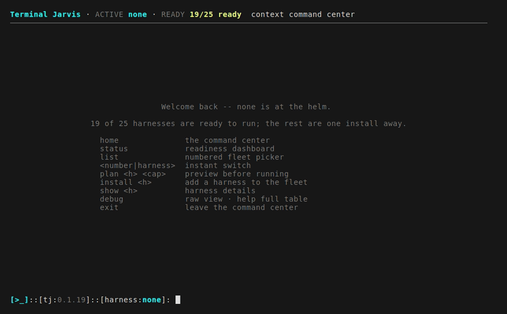

<div align="center">

# Terminal Jarvis

**Command center for orchestrating context switching between coding-agent harnesses**

> **Safe Testing Recommended**: Terminal Jarvis is a harness for AI coding tools
> that can modify files and execute commands. For the safest experience, test in
> a remote development environment such as
> [GitHub Codespaces](https://github.com/codespaces),
> [Coder](https://coder.com/), [DevPod](https://devpod.sh/), or
> [Google Colab](https://colab.research.google.com/).

[](https://www.npmjs.com/package/terminal-jarvis)
[](https://crates.io/crates/terminal-jarvis)
[](https://github.com/BA-CalderonMorales/homebrew-terminal-jarvis)
[](https://opensource.org/licenses/MIT)
[](https://github.com/Piebald-AI/awesome-gemini-cli)
[](https://ba-calderonmorales.github.io/my-life-as-a-dev/latest/projects/active/terminal-jarvis/)
[](https://github.com/BA-CalderonMorales/terminal-jarvis/actions/workflows/ci.yml?query=branch%3Adevelop)



</div>

## Install

Package mechanics, supported platforms, and update behavior: [Installation](docs/installation.md).

```bash
# Cargo
cargo install terminal-jarvis
# Cargo binary name is terminal-jarvis; add an alias if you want a short call:
#   echo 'alias tj=terminal-jarvis' >> ~/.bashrc

# npm
npm install -g terminal-jarvis
# The npm package also installs a tj shim, so you can call either:
#   terminal-jarvis list   # or  tj list

# Homebrew
brew install BA-CalderonMorales/homebrew-terminal-jarvis/terminal-jarvis
```

| Environment | Invoke with |
|---|---|
| Global install (`npm install -g` / `brew install` / `cargo install`) | `terminal-jarvis list` or `tj list` |
| No install -- run on demand from anywhere | `npx terminal-jarvis list` |
| Built from source (this repository) | `cargo run -- list` |

## Quick Start

Inspect and safely gate catalog descriptors for Claude, Gemini, Qwen, Pi, Droid and a variety of other AI assistants from one terminal interface. The modes, the launch guards, and the full command surface: [Usage](docs/usage.md).

```bash
# Open the interactive switcher (bare tj on a terminal does the same)
terminal-jarvis tui

# List every coding agent
terminal-jarvis list

# Inspect a harness
terminal-jarvis show opencode

# Preview a capability command
terminal-jarvis plan codex headless

# Select and verify the active harness
terminal-jarvis use opencode
terminal-jarvis current
terminal-jarvis check

# Optional: block harness commands until Trivy clears this workspace
terminal-jarvis gate enable trivy
terminal-jarvis gate status
```

## Layout

The repository is a few small planes, and every Rust domain is bucketed the
same way -- once you can read one, you can read them all.

```text
src/                            # the std-only Rust CLI
├── main.rs                     # entry point; lib.rs is the crate root
├── contracts/                  # the shared data model (Harness, capabilities)
├── cli/                        # parsing, guards, dispatch, tables, help
├── catalog/                    # loads and validates the data plane
├── context/                    # platform, distribution, active-harness state
├── diagnostics/                # readiness reports, probes, PATH resolution
├── gates/                      # optional local security gate (Trivy)
├── runtime/                    # executes harness capability commands
├── security/                   # credential and effect posture
└── tui/                        # the interactive switcher (chat-style shell)
```

```text
harnesses/<agent>/              # the data plane: one folder per coding agent
├── index.toml                  # name, display, binary, env requirements
├── download/index.toml         # install without sudo
├── update/index.toml           # upgrade without interactive auth
├── headless/index.toml         # non-interactive command mode
├── version/index.toml          # print installed agent version
├── stats/index.toml            # local agent statistics
├── models/index.toml           # list available models
├── security/index.toml         # sandbox and approval settings
├── ui/index.toml               # interactive terminal UI
└── yolo/index.toml             # bypass safeguards (dangerous)
```

```text
tests/                          # integration tests, one binary per domain
scripts/bash/                   # automation: catalog, delivery, release, verify
docs/                           # decisions, contracts, usage, demo, legacy
build/                          # the build script only
npm/  homebrew/                 # distribution launchers and formulae
```

Each Rust domain inside `src/` keeps the same shape: `index.rs` as the public
face, `logic/` for behavior, `structs/` for data, `tests/` for proof, and
every file stays at 100 lines or fewer.

## Docs

What this is for, and the catalog truth behind it: [What is this?](docs/what-is-this.md).

| Document | What |
|---|---|
| [Maintainer guide](docs/maintainer.md) | The command surface, mode by mode; the security model |
| [Installation](docs/installation.md) | Package mechanics, supported platforms, update behavior |
| [Usage](docs/usage.md) | Headless vs interactive, launch guards |
| [Capability contract](docs/harness-capability-contract.md) | Full breakdown of the 9 capabilities |
| [Security gates](docs/security-gates.md) | Optional Trivy scan behavior and configuration |
| [Cataloged agents](docs/supported-agents.md) | All 25 descriptors and support caveat |
| [Support matrix](docs/support-matrix.md) | All 225 capability truth rows |
| [Development](docs/development.md) | Architecture, verification, and release artifacts |
| [Demo](docs/demo.md) | The recording, the agent-handover script, making new demos |
| [Legacy notes](docs/legacy-notes.md) | Aliases, plain output behavior, removed experiments |
